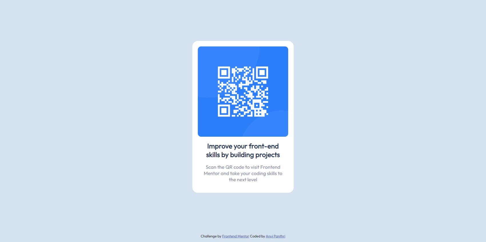
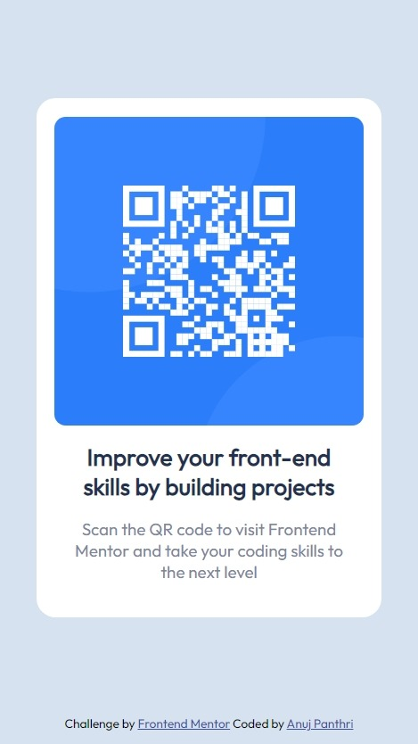

# Frontend Mentor - QR code component solution

This is a solution to the [QR code component challenge on Frontend Mentor](https://www.frontendmentor.io/challenges/qr-code-component-iux_sIO_H). Frontend Mentor challenges help you improve your coding skills by building realistic projects. 

## Table of contents

- [Overview](#overview)
  - [Screenshot](#screenshot)
  - [Links](#links)
- [My process](#my-process)
  - [Built with](#built-with)
  - [What I learned](#what-i-learned)
- [Author](#author)

**Note: Delete this note and update the table of contents based on what sections you keep.**

## Overview

### Screenshot

Desktop view

Mobile view

### Links

- Solution URL: [https://github.com/AnujPanthri/QR-Code-Component-Challenge](https://github.com/AnujPanthri/QR-Code-Component-Challenge)
- Live Site URL: [https://anujpanthri.github.io/QR-Code-Component-Challenge/](https://anujpanthri.github.io/QR-Code-Component-Challenge/)

## My process

### Built with

- Semantic HTML5 markup
- CSS custom properties
- Flexbox
- Mobile-first workflow
- MIN css function for responsive design without using mediaquery

### What I learned

Well this challenge looked simple but still I had to figure out how to do it efficiently while maintaining clean code. Also I learned how to give attention to little details to make a look alike from the design only.

## Author

- Github - [@AnujPanthri](https://github.com/AnujPanthri)
- Frontend Mentor - [@AnujPanthri](https://www.frontendmentor.io/profile/AnujPanthri)